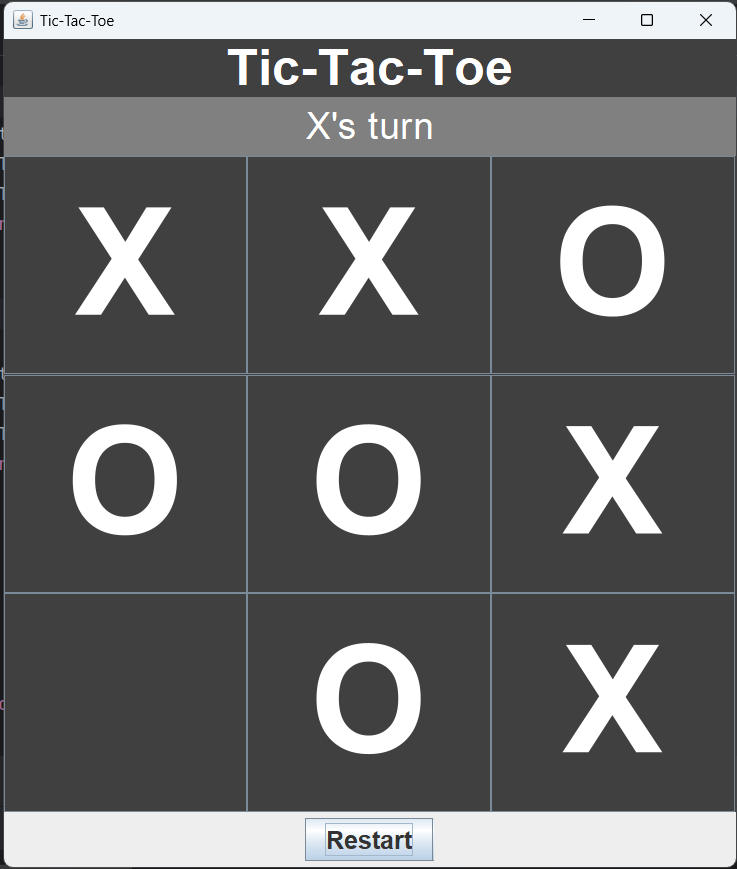

# Tic-Tac-Toe Game

## 📝 Summary

This is a simple 2-player **Tic-Tac-Toe** game built using **Java Swing GUI**. Players take turns to mark X or O in a 3x3 grid. The first player to get three in a row wins. The game also detects ties and includes a restart option.

---

## ⭐ Features

- Simple and clean user interface
- Turn indicator for current player
- Detects winner or tie
- Highlights winning tiles
- Restart button to play again

---

## 🛠️ Technology Used

- Java (JDK)
- Java Swing GUI components:
  - `JFrame`, `JPanel`, `JButton`, `JLabel`, etc.

---

## 🖼️ Interface

---

## 👤 Author

**Md. Riad Hasan**  
BSCSE   
**Uttara University**

---

